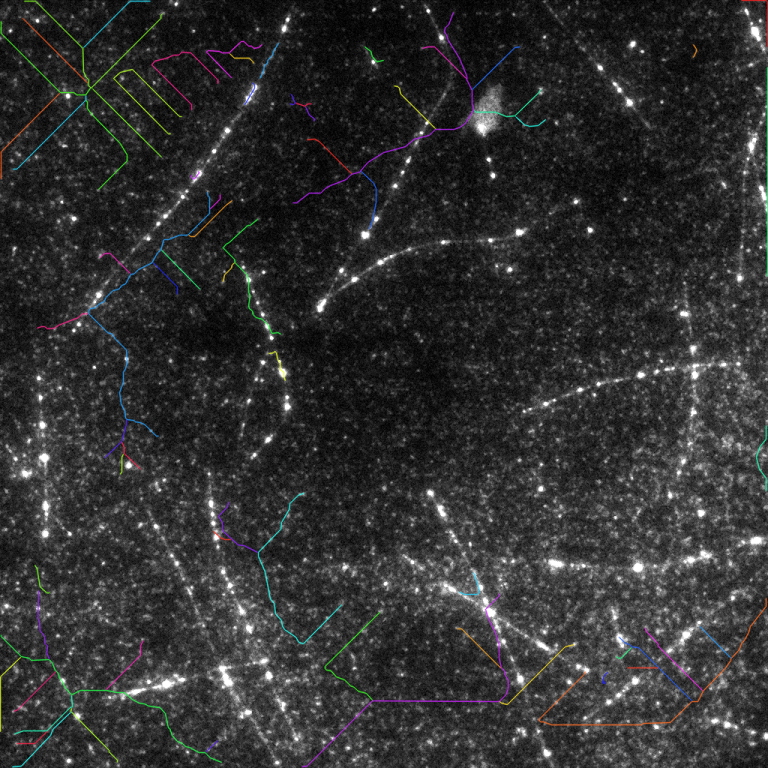
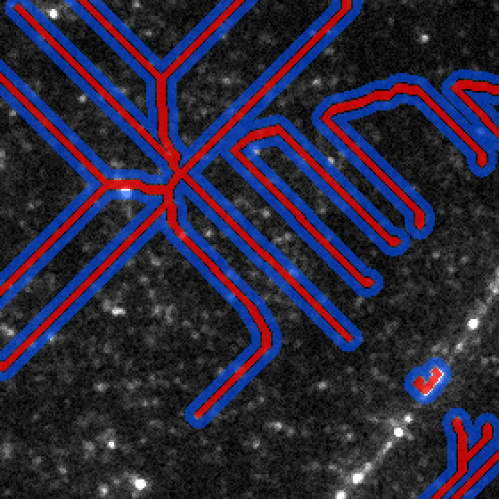

# AutomatedEssaysModule

**Automated microtubule analysis of ND2 well recordings.** Point this tool at a
folder of `.nd2` files (one per well) and it detects every microtubule (MT) in
every position and writes one table row per microtubule with its length and its
on-MT vs. background fluorescence — plus the well's solution concentration.

It wraps a trained instance-segmentation model (**DINOv3-L → DPT → PySOAX**,
"microtubule v7") that traces each microtubule as an open centerline; a
measurement layer turns those centerlines into numbers.



*Each coloured line is one detected microtubule (well D04, position 0 — 70 MTs).*

---

## Contents

1. [What it measures](#1-what-it-measures)
2. [Quick start](#2-quick-start)
3. [Installation](#3-installation)
4. [The model weights](#4-the-model-weights)
5. [Running it](#5-running-it)
6. [Command-line options](#6-command-line-options)
7. [Input: what the ND2 files must contain](#7-input-what-the-nd2-files-must-contain)
8. [Output](#8-output)
9. [How the measurements are defined](#9-how-the-measurements-are-defined)
10. [Performance](#10-performance)
11. [Troubleshooting](#11-troubleshooting)
12. [FAQ](#12-faq)
13. [Repository layout](#13-repository-layout)

---

## 1. What it measures

For **every microtubule** in every position of every well, one row in
`results.csv`:

| Column | Meaning |
| ------ | ------- |
| `well_id` | well identifier parsed from the file name (e.g. `D04`) |
| `position` | 0-based field-of-view index within the well |
| `mt_id` | microtubule index within that position (1, 2, 3, …) |
| `solution_intensity_median` | **solution concentration proxy** = median of the `488 InSol` channel for that position |
| `length_px`, `length_um` | microtubule length along its centerline (µm uses the ND2 pixel calibration) |
| `mt_mean_intensity` | mean TIRF intensity over the **MT band** (strip `--mt-width`, default 5 px, wide) |
| `mt_std_intensity` | standard deviation of TIRF intensity over the MT band |
| `mt_sum_intensity` | summed (integrated) TIRF intensity over the MT band |
| `bg_mean_intensity` | mean TIRF intensity over the **background ring** around the MT |
| `bg_median_intensity` | median TIRF intensity over the background ring (robust to bright spots) |
| `bg_sum_intensity` | summed TIRF intensity over the background ring |
| `net_mean_intensity` | `mt_mean_intensity − bg_mean_intensity` (background-subtracted signal) |
| `n_px_mt`, `n_px_bg` | number of pixels in the band / ring |
| `source_file` | originating `.nd2` file name |

It also writes a QC **overlay PNG** and a **polyline annotation JSON** per
position (toggle off with `--no-overlays` / `--no-json`).

---

## 2. Quick start

```bash
git clone https://github.com/michalprusek/AutomatedEssaysModule.git
cd AutomatedEssaysModule

python3 -m venv .venv
source .venv/bin/activate                 # Windows: .venv\Scripts\activate
pip install --upgrade pip
pip install -r requirements.txt

# run on a folder of well recordings (weights auto-download on first run)
python evaluate.py --data /path/to/well_recordings --out results/
```

Results land in `results/results.csv`, with `results/overlays/` and
`results/annotations/`.

> **Try one well first:** add `--limit-wells 1` for a ~2–3 minute smoke run
> before launching the whole batch.

---

## 3. Installation

**Requirements:** Python **3.10–3.12**, ~3 GB free disk (1.2 GB weights + the
dependencies), and the GitHub CLI [`gh`](https://cli.github.com) authenticated
(`gh auth login`) so the weights can be fetched from the private release.

```bash
python3 -m venv .venv
source .venv/bin/activate
pip install --upgrade pip
pip install -r requirements.txt
```

All dependencies are version-pinned (`requirements.txt`) to exactly the
versions the model was trained/validated against — `torch 2.6.0`,
`transformers 4.57.1`, `numpy 1.26.4`, etc. — and ship as prebuilt wheels for
macOS arm64 and Linux x86-64, so nothing is compiled. **Use a virtual
environment**; installing these pins globally may clash with other projects.

A CUDA GPU is used automatically if present (much faster); otherwise it runs on
CPU.

---

## 4. The model weights

The 1.2 GB checkpoint `weights/microtubule_v7.pt` is **not** stored in git. On
the first run, `evaluate.py` downloads it from this repository's GitHub Release
`weights-v7` using `gh` (which reuses your existing GitHub credentials). You can
also fetch it explicitly:

```bash
python scripts/download_weights.py            # -> weights/microtubule_v7.pt
```

If you cannot use `gh`, download `microtubule_v7.pt` from the
[release page](https://github.com/michalprusek/AutomatedEssaysModule/releases/tag/weights-v7)
and pass `--weights /path/to/microtubule_v7.pt`.

> **No HuggingFace token or login is required.** The checkpoint already contains
> the DINOv3 backbone weights, so the backbone is rebuilt offline from the
> bundled config in `config/dinov3_vitl16` — the pipeline runs with no network
> access once the weights are present. (See [`MODEL.md`](MODEL.md) for the
> optional online path.)

---

## 5. Running it

```bash
# a whole folder of wells (searched recursively)
python evaluate.py --data /data/260619_Consistency_2 --out results/

# a single file
python evaluate.py --data /data/WellD04_....nd2 --out results/

# fast smoke run: first well only, no overlay images
python evaluate.py --data /data/wells --limit-wells 1 --no-overlays

# custom band / background geometry and a higher detection threshold
python evaluate.py --data /data/wells --mt-width 5 --bg-gap 1 --bg-width 5 \
    --threshold 0.6

# force CPU (default on Mac); 'cuda' uses the GPU if available
python evaluate.py --data /data/wells --device cpu
```

`results.csv` is flushed after **every position**, so an interrupted batch
keeps its partial results.

---

## 6. Command-line options

| Flag | Default | Meaning |
| ---- | ------- | ------- |
| `--data` | *(required)* | Folder of `.nd2` files (recursive) or a single `.nd2`. |
| `--out` | `results` | Output directory (`results.csv`, `overlays/`, `annotations/`). |
| `--weights` | `weights/microtubule_v7.pt` | Checkpoint path (auto-downloaded if missing). |
| `--device` | `auto` | `auto` = CUDA if present else CPU. Also `cpu` / `cuda` / `mps`. |
| `--threshold` | `0.5` | Seed-probability threshold of the segmentation model. Higher = stricter (fewer, more confident MTs). |
| `--mt-width` | `5` | Width of the on-MT band across the centerline (px). |
| `--bg-gap` | `1` | Gap between the MT band and the background ring (px). |
| `--bg-width` | `5` | Width of the background ring (px). |
| `--tirf-name` | `tirf` | Substring identifying the TIRF (microtubule) channel. |
| `--solution-name` | `insol,in sol,solution` | Comma-separated substrings identifying the solution channel. |
| `--no-overlays` | off | Skip overlay PNGs. |
| `--no-json` | off | Skip annotation JSON. |
| `--limit-wells` | `0` | Process at most N wells (0 = all). |
| `--online-backbone` | off | Download the gated DINOv3 backbone from HuggingFace instead of rebuilding it offline (needs `HF_TOKEN`). Not normally needed. |

---

## 7. Input: what the ND2 files must contain

* **One `.nd2` file per well**; the file name should contain `Well<id>` (e.g.
  `WellD04_Channel...nd2`) — `D04` becomes `well_id`. Files that don't match
  fall back to the file stem.
* Each file holds **several positions** (fields of view) and **three channels**.
  Channels are matched **by name**, not by order, so acquisition-order changes
  don't matter. By default it looks for:
  * the **TIRF** channel — name contains `TIRF` (the microtubule signal),
  * the **solution** channel — name contains `InSol` / `in sol` / `solution`.
  Override with `--tirf-name` / `--solution-name` if your channels are named
  differently.
* Pixel calibration is read from the ND2 (used for `length_um`); if it's
  missing, `length_um` is left blank and `length_px` is still reported.

The IRM channel is not required by the measurement and is ignored.

---

## 8. Output

```
results/
├── results.csv                 # one row per microtubule (see §1)
├── overlays/
│   ├── D04_pos0.png            # centerlines drawn on the TIRF frame (QC)
│   └── ...
└── annotations/
    ├── D04_pos0.json           # centerlines as polylines (points are x=col, y=row px)
    └── ...
```

Example `results.csv` rows:

```csv
well_id,position,mt_id,solution_intensity_median,length_px,length_um,mt_mean_intensity,mt_std_intensity,mt_sum_intensity,bg_mean_intensity,bg_median_intensity,bg_sum_intensity,net_mean_intensity,n_px_mt,n_px_bg,source_file
D04,0,1,4603.0,95.83,6.9209,176.503,20.986,51892.0,194.811,182.0,99743.0,-18.307,294,512,"WellD04_....nd2"
D04,0,2,4603.0,299.46,21.6278,158.946,20.668,182311.0,156.894,155.0,438677.0,2.051,1147,2796,"WellD04_....nd2"
```

Read it in Python:

```python
import pandas as pd
df = pd.read_csv("results/results.csv")
df.groupby("well_id")["length_um"].describe()          # per-well length stats
df.groupby(["well_id", "position"])["mt_id"].count()   # MT count per position
```

The annotation JSON per position:

```jsonc
{
  "well_id": "D04", "position": 0,
  "image_size": { "width": 1024, "height": 1024 },
  "num_microtubules": 70,
  "polylines": [
    { "mt_id": 1, "class": "microtubule", "geometry": "polyline",
      "points": [ { "x": 12.0, "y": 34.0 }, ... ],
      "vertices_count": 57, "length_px": 95.83, "length_um": 6.9209 }
  ]
}
```

---

## 9. How the measurements are defined

**Solution concentration.** The median pixel value of the `488 InSol` channel
for that position. Median (not mean) is used so it is unaffected by the bright
microtubules bleeding into the channel.

**Microtubule length.** The arc length of the model's centerline polyline
(sum of segment lengths), in pixels and — using the ND2 calibration — microns.

**On-MT band vs. background ring.** The centerline is rasterised and dilated to
a fixed width to form the **MT band**; a strip *around* it (but outside it, and
outside every other MT) forms the **background ring**:

```
   ...background ring...  gap  [====== MT band ======]  gap  ...background ring...
        (--bg-width)    (--bg-gap)   (--mt-width)     (--bg-gap)    (--bg-width)
         5 px            1 px          5 px            1 px          5 px
```

* The **MT band** (`--mt-width`, default **5** px) is the set of pixels counted
  as "on the microtubule".
* The **background ring** is every pixel within `--bg-gap + --bg-width` of *this*
  microtubule but **not** within `--bg-gap` of *any* microtubule band. The gap
  (default **1** px) drops point-spread-function bleed of the signal; excluding
  *all* bands stops a neighbouring filament from inflating the background.

The image below shows the bands (red) and background rings (blue) on a real
crowded field — note the rings never cross onto a neighbouring filament:



`net_mean_intensity = mt_mean_intensity − bg_mean_intensity` is the
background-subtracted signal. All intensities are raw 16-bit camera counts (the
images are not pre-scaled).

---

## 10. Performance

The model is a ViT-L, so it is compute-heavy:

| Hardware | Per position | 180-well batch (900 positions) |
| -------- | ------------ | ------------------------------ |
| CUDA GPU | a few seconds | ~2 hours |
| Mac / CPU | ~25–35 s | ~7 hours |

`results.csv` is written incrementally, so long runs are safe to interrupt and
the partial table stays valid. Use `--device cpu` on a Mac (the default;
`mps` is experimental and may differ from CPU).

---

## 11. Troubleshooting

| Symptom | Fix |
| ------- | --- |
| `gh: ... not found` / weights won't download | Install [`gh`](https://cli.github.com) and run `gh auth login`, or download the asset manually and pass `--weights /path/to/microtubule_v7.pt`. |
| `no .nd2 files found` | Check `--data`; the folder is searched recursively for `*.nd2`. |
| `no channel matching ('tirf',)` | Your TIRF channel is named differently — pass `--tirf-name <substring>` (likewise `--solution-name`). |
| `weights_only` load warning on startup | Expected; the checkpoint embeds a small config object and the loader falls back safely. Set `ALLOW_UNSAFE_WEIGHTS=0` to refuse. |
| Very slow on a Mac | Expected for a ViT-L on CPU. Use a CUDA GPU for the full batch, or run overnight. |
| `OSError: ... gated repo` / HF 401 | Only happens with `--online-backbone`. Don't use that flag — the default offline path needs no token. |
| `ModuleNotFoundError: synth_irm` / `pysoax` | Run from the repo root and keep the `microtubule/` directory intact (don't flatten it). |

---

## 12. FAQ

**Do I need a HuggingFace account or token?** No. The weights are
self-contained; the backbone is rebuilt offline from the bundled config.

**Does it need a GPU?** No, but a GPU is ~10× faster. CPU works fine for a few
wells or an overnight batch.

**Can I change the band / background widths?** Yes — `--mt-width`, `--bg-gap`,
`--bg-width` (all in pixels). The defaults are 5 / 1 / 5.

**It found too few / too many microtubules.** Tune `--threshold` (default 0.5):
higher finds fewer, more confident MTs; lower finds more (and more noise).
Inspect `overlays/` to judge.

**Can I segment a single image (not a well recording)?** Yes — `infer.py`
handles one frame at a time and writes centerlines as JSON; see
[`MODEL.md`](MODEL.md).

---

## 13. Repository layout

```
evaluate.py                 # batch entry point — start here
mt_pipeline/                # measurement layer
  nd2_io.py                 #   read ND2, pick channels by name, iterate positions
  measure.py                #   MT band / background ring masks + intensity stats
  report.py                 #   results.csv, overlays, annotation JSON
microtubule/                # the v7 segmentation model package (do not flatten)
config/dinov3_vitl16/       # bundled backbone config (enables offline, token-free)
scripts/download_weights.py # fetches microtubule_v7.pt from the GitHub Release
infer.py                    # single-frame segmentation CLI (diagnostic)
weights/microtubule_v7.pt   # downloaded on first run, not in git
docs/                       # README images
MODEL.md                    # model internals + single-frame CLI reference
```

The segmentation model and the single-frame CLI are documented in
[`MODEL.md`](MODEL.md).
