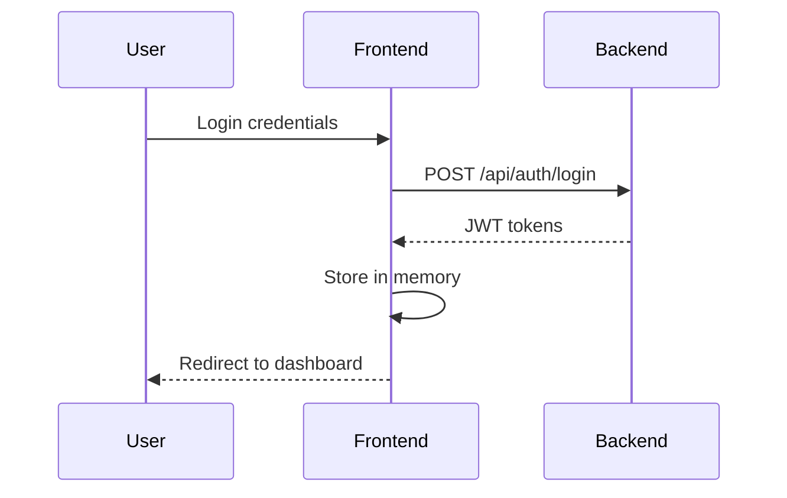
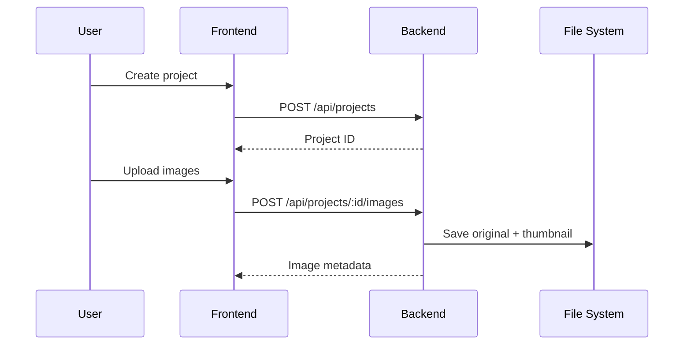
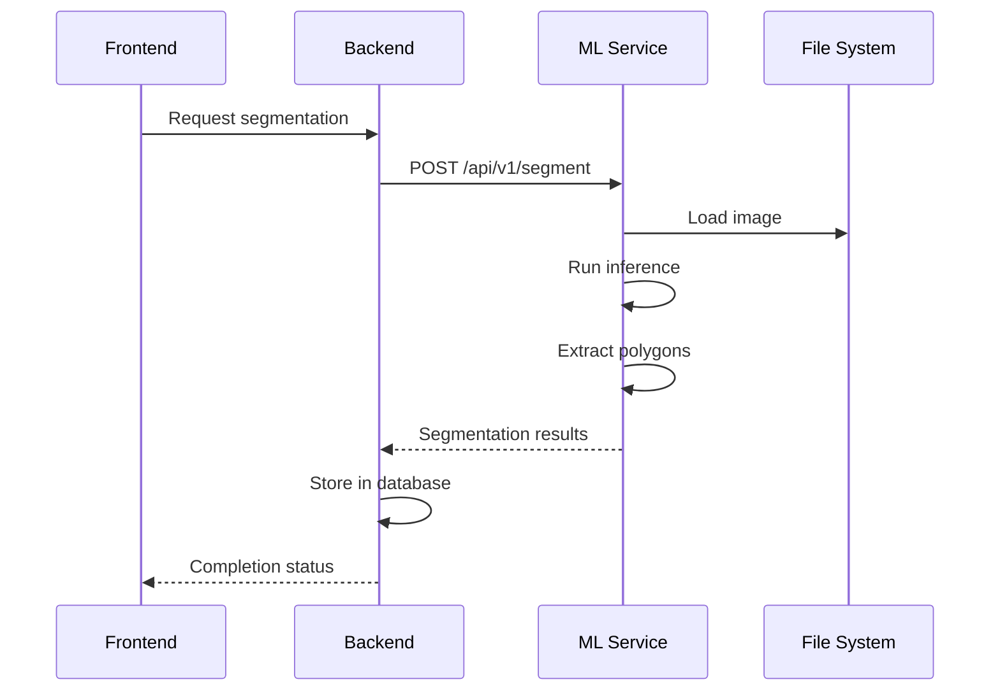

# System Architecture

Cell Segmentation Hub is a modern, microservices-based web application designed for AI-powered cell segmentation analysis. The system consists of three main components working together to provide a seamless user experience.

## High-Level Overview

```
┌─────────────────┐    ┌─────────────────┐    ┌─────────────────┐
│   React Frontend │    │  Node.js Backend│    │ Python ML Service│
│   (Port 8082)   │◄──►│   (Port 3001)   │◄──►│   (Port 8000)    │
└─────────────────┘    └─────────────────┘    └─────────────────┘
        │                        │                        │
        │                        │                        │
        ▼                        ▼                        ▼
┌─────────────────┐    ┌─────────────────┐    ┌─────────────────┐
│   Web Browser   │    │ SQLite Database │    │  ML Model Files │
│                 │    │   (Prisma ORM)  │    │  (PyTorch)      │
└─────────────────┘    └─────────────────┘    └─────────────────┘
```

## Component Architecture

### Frontend Layer

- **Technology**: React 18 + TypeScript + Vite
- **UI Framework**: shadcn/ui with Tailwind CSS
- **State Management**: React Query + React Context
- **Routing**: React Router v6
- **Port**: 8082 (development)

### Backend API Layer

- **Technology**: Node.js + Express + TypeScript
- **Database**: SQLite with Prisma ORM
- **Authentication**: JWT tokens (access + refresh)
- **File Storage**: Local filesystem with Sharp thumbnails
- **Port**: 3001

### ML Service Layer

- **Technology**: Python + FastAPI
- **ML Framework**: PyTorch
- **Models**: HRNet, ResUNet Advanced, ResUNet Small
- **Image Processing**: OpenCV, PIL, scikit-image
- **Port**: 8000

## Data Flow

### 1. User Authentication



### 2. Project Creation & Image Upload



### 3. ML Segmentation Process



## Security Architecture

### Authentication Flow

1. **Login**: User credentials → JWT access token (15min) + refresh token (7 days)
2. **Authorization**: Protected routes require valid JWT in Authorization header
3. **Token Refresh**: Automatic refresh using refresh token when access token expires
4. **Session Management**: Refresh tokens stored securely with industry-recommended controls:
   - **Idle Expiration**: Sessions expire after 30 minutes of inactivity
   - **Absolute Expiration**: Hard limit of 7 days regardless of activity
   - **Token Rotation**: New refresh token issued on each use, old token invalidated
   - **Secure Storage**: Database storage with encrypted values and revocation capability
   - **CSRF Protection**: Refresh tokens bound to specific client sessions and IP addresses

### Security Measures

- **CORS**: Configured origins for cross-domain requests
- **Helmet**: Security headers for XSS, CSP protection
- **Rate Limiting**: API request throttling
- **Input Validation**: Zod schemas for request validation
- **File Upload Security**: MIME type validation, size limits

## Database Architecture

### Core Entities

- **Users**: Authentication and profile data
- **Projects**: User project containers
- **Images**: File metadata and processing status
- **Segmentations**: ML results and polygon data
- **Sessions**: Refresh token management

### Relationships

```
User 1:N Projects 1:N Images 1:1 Segmentations
User 1:1 Profile
User 1:N Sessions
```

## Deployment Architecture

### Development

- **Frontend**: Vite dev server (HMR enabled)
- **Backend**: tsx watch mode
- **ML Service**: uvicorn with reload
- **Database**: SQLite file

### Production (Docker)

```
┌─────────────────────────────────────────┐
│              Docker Network             │
│  ┌─────────┐ ┌─────────┐ ┌───────────┐ │
│  │Frontend │ │ Backend │ │ML Service │ │
│  │Container│ │Container│ │ Container │ │
│  └─────────┘ └─────────┘ └───────────┘ │
│       │            │            │      │
│       └────────────┼────────────┘      │
│                    │                   │
│            ┌─────────────┐              │
│            │   Volumes   │              │
│            │  - db-data  │              │
│            │  - uploads  │              │
│            │  - models   │              │
│            └─────────────┘              │
└─────────────────────────────────────────┘
```

## Performance Considerations

### Frontend Optimizations

- **Code Splitting**: Lazy loading of routes
- **Image Optimization**: Thumbnail generation, lazy loading
- **State Management**: Efficient React Query caching
- **Bundle Size**: Tree shaking, modern build tools

### Backend Optimizations

- **Database**: Prisma query optimization, indexing
- **File Handling**: Streaming, thumbnail generation
- **Caching**: In-memory caching for frequent queries
- **Connection Pooling**: Efficient database connections

### ML Service Optimizations

- **Model Loading**: Pre-loading frequently used models
- **Memory Management**: Efficient tensor operations
- **Batch Processing**: Multiple image processing
- **GPU Support**: CUDA acceleration when available

## Scalability Considerations

### Horizontal Scaling Options

1. **Load Balancer**: Multiple backend instances
2. **Database**: PostgreSQL cluster for production
3. **File Storage**: Cloud storage (S3, Google Cloud)
4. **ML Service**: Multiple GPU instances
5. **Caching**: Redis for session storage

### Monitoring & Observability

- **Health Checks**: Service availability monitoring
- **Logging**: Structured logging with correlation IDs
- **Metrics**: Performance and error tracking
- **Tracing**: Request flow tracking across services

## Technology Stack Summary

| Layer                | Technology         | Purpose                 |
| -------------------- | ------------------ | ----------------------- |
| **Frontend**         | React + TypeScript | User interface          |
| **Build Tool**       | Vite               | Fast development builds |
| **Styling**          | Tailwind CSS       | Utility-first styling   |
| **UI Components**    | shadcn/ui + Radix  | Accessible components   |
| **State Management** | React Query        | Server state            |
| **Backend**          | Node.js + Express  | API server              |
| **Database**         | SQLite + Prisma    | Data persistence        |
| **Authentication**   | JWT                | Stateless auth          |
| **ML Service**       | Python + FastAPI   | AI inference            |
| **ML Framework**     | PyTorch            | Deep learning           |
| **Image Processing** | Sharp, OpenCV      | Image manipulation      |
| **Containerization** | Docker             | Deployment              |
| **Development**      | TypeScript         | Type safety             |

For detailed component documentation, see:

- [Frontend Architecture](./frontend.md)
- [Backend Architecture](./backend.md)
- [ML Service Architecture](./ml-service.md)
