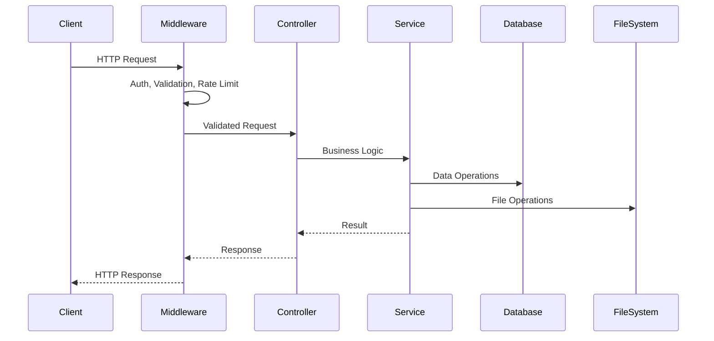

# Backend Architecture

The backend is a Node.js API server built with Express and TypeScript, providing secure REST endpoints for user management, project handling, and ML service integration.

## Technology Stack

- **Runtime**: Node.js with TypeScript
- **Framework**: Express.js
- **Database**: SQLite with Prisma ORM
- **Authentication**: JWT (access + refresh tokens)
- **File Storage**: Local filesystem with Sharp image processing
- **Validation**: Zod schemas + express-validator
- **Security**: Helmet, CORS, rate limiting
- **Logging**: Winston structured logging

## Project Structure

```
backend/src/
├── api/                    # API layer
│   ├── controllers/        # Request handlers
│   │   ├── authController.ts
│   │   ├── projectController.ts
│   │   ├── imageController.ts
│   │   └── segmentationController.ts
│   └── routes/            # Route definitions
│       ├── authRoutes.ts
│       ├── projectRoutes.ts
│       ├── imageRoutes.ts
│       └── segmentationRoutes.ts
├── auth/                  # Authentication utilities
│   ├── jwt.ts             # JWT token management
│   ├── password.ts        # Password hashing
│   └── validation.ts      # Auth validation schemas
├── db/                    # Database utilities
│   ├── index.ts           # Prisma client setup
│   └── seed.ts            # Database seeding
├── middleware/            # Express middleware
│   ├── auth.ts            # JWT authentication
│   ├── error.ts           # Error handling
│   ├── upload.ts          # File upload handling
│   └── validation.ts      # Request validation
├── services/              # Business logic
│   ├── authService.ts
│   ├── projectService.ts
│   ├── imageService.ts
│   └── segmentationService.ts
├── storage/               # File storage abstraction
│   ├── interface.ts       # Storage interface
│   ├── localStorage.ts    # Local file storage
│   └── index.ts           # Storage factory
├── types/                 # TypeScript definitions
│   ├── index.ts           # Common types
│   └── validation.ts      # Validation schemas
├── utils/                 # Utilities
│   ├── config.ts          # Configuration management
│   ├── logger.ts          # Logging setup
│   └── response.ts        # Response helpers
└── server.ts              # Application entry point
```

## Core Architecture Patterns

### Layered Architecture

The backend follows a clean layered architecture:

```
┌─────────────────────┐
│    Controllers      │  ← Handle HTTP requests/responses
├─────────────────────┤
│     Services        │  ← Business logic & orchestration  
├─────────────────────┤
│   Data Access       │  ← Database operations (Prisma)
├─────────────────────┤
│     Storage         │  ← File system operations
└─────────────────────┘
```

### Request Flow



## Authentication System

### JWT Token Strategy

```typescript
// Dual token approach
interface TokenPair {
  accessToken: string;  // Short-lived (15 minutes)
  refreshToken: string; // Long-lived (7 days)
}

// Token generation
const generateTokenPair = (userId: string): TokenPair => {
  const accessToken = jwt.sign(
    { userId, type: 'access' },
    config.JWT_ACCESS_SECRET,
    { expiresIn: '15m' }
  );
  
  const refreshToken = jwt.sign(
    { userId, type: 'refresh' },
    config.JWT_REFRESH_SECRET,
    { expiresIn: '7d' }
  );
  
  return { accessToken, refreshToken };
};
```

### Authentication Middleware

```typescript
export const authenticateToken = async (
  req: Request,
  res: Response,
  next: NextFunction
) => {
  try {
    const authHeader = req.headers.authorization;
    const token = authHeader?.startsWith('Bearer ') ? authHeader.slice(7) : null;
    
    if (!token) {
      return ResponseHelper.unauthorized(res, 'Access token required');
    }
    
    const decoded = jwt.verify(token, config.JWT_ACCESS_SECRET) as JWTPayload;
    
    if (decoded.type !== 'access') {
      return ResponseHelper.unauthorized(res, 'Invalid token type');
    }
    
    // Attach user to request
    req.userId = decoded.userId;
    next();
  } catch (error) {
    if (error.name === 'TokenExpiredError') {
      return ResponseHelper.unauthorized(res, 'Token expired');
    }
    return ResponseHelper.unauthorized(res, 'Invalid token');
  }
};
```

### Password Security

```typescript
// bcryptjs with salt rounds
const SALT_ROUNDS = 12;

export const hashPassword = async (password: string): Promise<string> => {
  return bcrypt.hash(password, SALT_ROUNDS);
};

export const comparePasswords = async (
  password: string,
  hashedPassword: string
): Promise<boolean> => {
  return bcrypt.compare(password, hashedPassword);
};
```

## Database Layer

### Prisma ORM Integration

```typescript
// Database client setup
import { PrismaClient } from '@prisma/client';

const prisma = new PrismaClient({
  log: config.NODE_ENV === 'development' ? ['query', 'info', 'warn'] : ['error'],
  errorFormat: 'pretty',
});

// Connection management
export const initializeDatabase = async (): Promise<void> => {
  try {
    await prisma.$connect();
    logger.info('Database connected successfully');
  } catch (error) {
    logger.error('Database connection failed:', error);
    throw error;
  }
};

export const disconnectDatabase = async (): Promise<void> => {
  await prisma.$disconnect();
  logger.info('Database disconnected');
};
```

### Service Layer Pattern

```typescript
// Project service with transaction support
export class ProjectService {
  static async createProject(
    userId: string,
    projectData: CreateProjectData
  ): Promise<Project> {
    return prisma.$transaction(async (tx) => {
      // Validate user exists
      const user = await tx.user.findUnique({ where: { id: userId } });
      if (!user) {
        throw new AppError('User not found', 404);
      }
      
      // Create project
      const project = await tx.project.create({
        data: {
          ...projectData,
          userId,
        },
        include: {
          user: {
            select: { id: true, email: true }
          }
        }
      });
      
      logger.info(`Project created: ${project.id} by user: ${userId}`);
      return project;
    });
  }
  
  static async getUserProjects(userId: string): Promise<Project[]> {
    return prisma.project.findMany({
      where: { userId },
      include: {
        images: {
          select: {
            id: true,
            name: true,
            segmentationStatus: true,
            createdAt: true
          }
        },
        _count: {
          select: { images: true }
        }
      },
      orderBy: { updatedAt: 'desc' }
    });
  }
}
```

## File Storage System

### Storage Abstraction

```typescript
// Storage interface for flexibility
export interface StorageInterface {
  uploadFile(file: Express.Multer.File, path: string): Promise<string>;
  deleteFile(path: string): Promise<void>;
  getFileUrl(path: string): string;
  generateThumbnail(originalPath: string, thumbnailPath: string): Promise<void>;
}

// Local filesystem implementation
export class LocalStorage implements StorageInterface {
  constructor(private baseDir: string) {}
  
  async uploadFile(file: Express.Multer.File, relativePath: string): Promise<string> {
    const fullPath = path.join(this.baseDir, relativePath);
    await fs.ensureDir(path.dirname(fullPath));
    await fs.move(file.path, fullPath);
    return relativePath;
  }
  
  async generateThumbnail(originalPath: string, thumbnailPath: string): Promise<void> {
    const fullOriginalPath = path.join(this.baseDir, originalPath);
    const fullThumbnailPath = path.join(this.baseDir, thumbnailPath);
    
    await sharp(fullOriginalPath)
      .resize(300, 300, { fit: 'inside', withoutEnlargement: true })
      .jpeg({ quality: 80 })
      .toFile(fullThumbnailPath);
  }
}
```

### Image Processing Pipeline

```typescript
// Image service with processing
export class ImageService {
  static async uploadImages(
    projectId: string,
    files: Express.Multer.File[]
  ): Promise<ImageWithMetadata[]> {
    const results = await Promise.all(
      files.map(async (file) => {
        // Generate paths
        const filename = `${uuid.v4()}-${file.originalname}`;
        const originalPath = `projects/${projectId}/images/${filename}`;
        const thumbnailPath = `projects/${projectId}/thumbnails/thumb_${filename}`;
        
        // Upload original
        await storage.uploadFile(file, originalPath);
        
        // Get image metadata
        const metadata = await sharp(file.path).metadata();
        
        // Generate thumbnail
        await storage.generateThumbnail(originalPath, thumbnailPath);
        
        // Save to database
        const image = await prisma.image.create({
          data: {
            name: file.originalname,
            originalPath,
            thumbnailPath,
            projectId,
            fileSize: file.size,
            width: metadata.width,
            height: metadata.height,
            mimeType: file.mimetype,
          }
        });
        
        return {
          ...image,
          url: storage.getFileUrl(originalPath),
          thumbnailUrl: storage.getFileUrl(thumbnailPath),
        };
      })
    );
    
    return results;
  }
}
```

## API Integration

### ML Service Communication

```typescript
// Segmentation service integration
export class SegmentationService {
  static async requestSegmentation(
    imageId: string,
    model: string = 'hrnet',
    threshold: number = 0.5
  ): Promise<SegmentationResult> {
    const image = await prisma.image.findUnique({
      where: { id: imageId }
    });
    
    if (!image) {
      throw new AppError('Image not found', 404);
    }
    
    // Update status to processing
    await prisma.image.update({
      where: { id: imageId },
      data: { segmentationStatus: 'processing' }
    });
    
    try {
      // Call ML service
      const formData = new FormData();
      // Validate and sanitize the file path to prevent directory traversal
      if (!image.originalPath || image.originalPath.includes('..') || path.isAbsolute(image.originalPath)) {
        throw new Error('Invalid file path');
      }
      
      const safePath = path.resolve(config.UPLOAD_DIR, image.originalPath);
      const uploadDirResolved = path.resolve(config.UPLOAD_DIR);
      
      // Ensure the resolved path is within the upload directory
      if (!safePath.startsWith(uploadDirResolved)) {
        throw new Error('Path traversal attempt detected');
      }
      
      const imageBuffer = await fs.readFile(safePath);
      formData.append('file', imageBuffer, image.name);
      
      const response = await axios.post(
        `${config.SEGMENTATION_SERVICE_URL}/api/v1/segment`,
        formData,
        {
          headers: { 'Content-Type': 'multipart/form-data' },
          params: { model, threshold },
          timeout: 120000, // 2 minutes
        }
      );
      
      // Save results
      const segmentation = await prisma.segmentation.create({
        data: {
          imageId,
          polygons: JSON.stringify(response.data.polygons),
          model,
          threshold,
          confidence: response.data.confidence,
          processingTime: response.data.processing_time,
        }
      });
      
      // Update image status
      await prisma.image.update({
        where: { id: imageId },
        data: { segmentationStatus: 'completed' }
      });
      
      return {
        id: segmentation.id,
        polygons: JSON.parse(segmentation.polygons),
        confidence: segmentation.confidence,
        processingTime: segmentation.processingTime,
      };
      
    } catch (error) {
      // Update status to failed
      await prisma.image.update({
        where: { id: imageId },
        data: { segmentationStatus: 'failed' }
      });
      
      throw error;
    }
  }
}
```

## Error Handling

### Structured Error System

```typescript
// Custom error types
export class AppError extends Error {
  constructor(
    message: string,
    public statusCode: number = 500,
    public code?: string
  ) {
    super(message);
    this.name = 'AppError';
  }
}

// Global error handler
export const errorHandler = (
  error: Error,
  req: Request,
  res: Response,
  next: NextFunction
) => {
  logger.error('Error occurred:', {
    message: error.message,
    stack: error.stack,
    url: req.url,
    method: req.method,
    userId: req.userId,
  });
  
  if (error instanceof AppError) {
    return ResponseHelper.error(res, error.message, error.statusCode);
  }
  
  if (error.name === 'ValidationError') {
    return ResponseHelper.badRequest(res, error.message);
  }
  
  // Default server error
  return ResponseHelper.internalServerError(res, 'Internal server error');
};
```

### Response Helpers

```typescript
// Consistent response format
export class ResponseHelper {
  static success<T>(res: Response, data: T, message?: string, statusCode: number = 200) {
    return res.status(statusCode).json({
      success: true,
      message,
      data,
      timestamp: new Date().toISOString(),
    });
  }
  
  static error(res: Response, message: string, statusCode: number = 400, errors?: any) {
    return res.status(statusCode).json({
      success: false,
      error: message,
      errors,
      timestamp: new Date().toISOString(),
    });
  }
  
  static unauthorized(res: Response, message: string = 'Unauthorized') {
    return this.error(res, message, 401);
  }
  
  static forbidden(res: Response, message: string = 'Forbidden') {
    return this.error(res, message, 403);
  }
}
```

## Security Features

### Request Validation

```typescript
// Zod schema validation
export const createProjectSchema = z.object({
  body: z.object({
    title: z.string().min(1).max(255),
    description: z.string().max(1000).optional(),
  })
});

// Validation middleware
export const validateRequest = (schema: z.ZodSchema) => {
  return (req: Request, res: Response, next: NextFunction) => {
    try {
      const validatedData = schema.parse({
        body: req.body,
        query: req.query,
        params: req.params,
      });
      
      // Replace request data with validated data
      req.body = validatedData.body || req.body;
      req.query = validatedData.query || req.query;
      req.params = validatedData.params || req.params;
      
      next();
    } catch (error) {
      if (error instanceof z.ZodError) {
        return ResponseHelper.badRequest(res, 'Validation failed', {
          issues: error.errors
        });
      }
      next(error);
    }
  };
};
```

### Rate Limiting

```typescript
// Configurable rate limiting
const createRateLimiter = (options: {
  windowMs: number;
  max: number;
  message: string;
}) => {
  return rateLimit({
    windowMs: options.windowMs,
    max: options.max,
    message: {
      success: false,
      error: options.message
    },
    standardHeaders: true,
    legacyHeaders: false,
    handler: (req, res) => {
      return ResponseHelper.error(res, options.message, 429);
    }
  });
};

// Different limits for different endpoints
app.use('/api/auth/login', createRateLimiter({
  windowMs: 15 * 60 * 1000, // 15 minutes
  max: 5, // 5 attempts per window
  message: 'Too many login attempts'
}));
```

## Logging & Monitoring

### Structured Logging

```typescript
// Winston logger configuration
const logger = winston.createLogger({
  level: config.LOG_LEVEL,
  format: winston.format.combine(
    winston.format.timestamp(),
    winston.format.errors({ stack: true }),
    winston.format.json()
  ),
  transports: [
    new winston.transports.Console({
      format: config.NODE_ENV === 'development' 
        ? winston.format.combine(
            winston.format.colorize(),
            winston.format.simple()
          )
        : winston.format.json()
    }),
    new winston.transports.File({ 
      filename: 'logs/error.log', 
      level: 'error' 
    }),
    new winston.transports.File({ 
      filename: 'logs/combined.log' 
    })
  ]
});

// Request logging middleware
export const createRequestLogger = (serviceName: string) => {
  return (req: Request, res: Response, next: NextFunction) => {
    const start = Date.now();
    
    res.on('finish', () => {
      const duration = Date.now() - start;
      
      logger.info('HTTP Request', {
        service: serviceName,
        method: req.method,
        url: req.url,
        statusCode: res.statusCode,
        duration,
        userAgent: req.get('User-Agent'),
        ip: req.ip,
        userId: req.userId,
      });
    });
    
    next();
  };
};
```

### Health Checks

```typescript
// Database health check
export const checkDatabaseHealth = async () => {
  try {
    await prisma.$queryRaw`SELECT 1`;
    return { healthy: true, message: 'Database connection successful' };
  } catch (error) {
    return { 
      healthy: false, 
      message: 'Database connection failed',
      error: error.message 
    };
  }
};

// Comprehensive health endpoint
app.get('/health', async (req, res) => {
  const dbHealth = await checkDatabaseHealth();
  
  const healthData = {
    status: dbHealth.healthy ? 'healthy' : 'unhealthy',
    timestamp: new Date().toISOString(),
    version: process.env.npm_package_version || '1.0.0',
    environment: config.NODE_ENV,
    uptime: process.uptime(),
    memory: process.memoryUsage(),
    database: dbHealth,
  };
  
  return ResponseHelper.success(res, healthData, 
    dbHealth.healthy ? 'Service is healthy' : 'Service has issues'
  );
});
```

The backend architecture provides a robust, secure, and scalable foundation for the cell segmentation application, with clear separation of concerns and comprehensive error handling.